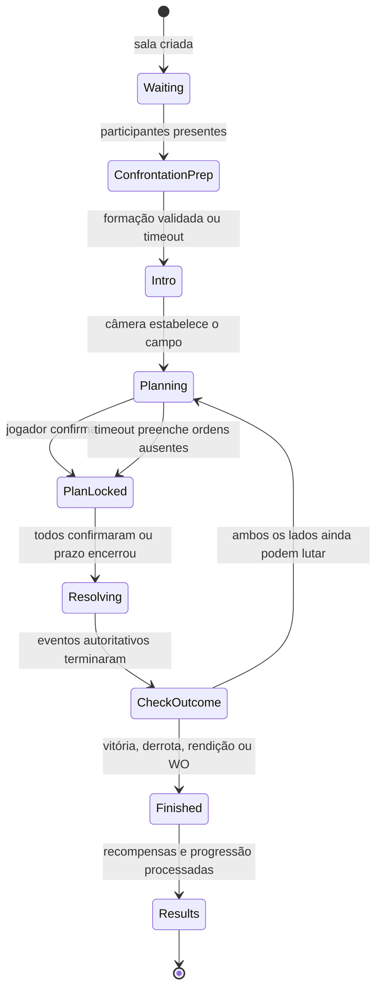

# MEGACOLISEUM — Especificação Visual e Mecânica da Batalha

> **Versão:** 1.0 — contrato-alvo para implementação incremental  
> **Data:** 2026-07-12  
> **Fonte criativa:** Wall  
> **Referência visual analisada:** `C:\Users\walla\Downloads\batalha.png` (1672 × 938, proporção 16:9)  
> **Documentos relacionados:** `GAME_DESIGN.md`, `PROJECT_ROADMAP.md`, `AI_SYNC.md`  
> **Regra de autoridade:** o servidor decide regras e resultados; o cliente apresenta intenção, câmera, HUD, animação, áudio e acessibilidade.

---

## 1. Objetivo deste documento

Este documento transforma a referência enviada por Wall em um contrato implementável para a batalha do MEGACOLISEUM. Ele define:

- composição exata da tela;
- posição da câmera, grade, personagens e HUD;
- fases e estados da batalha;
- Mana, ações, alvos, posições, reservas e confirmação;
- ordem e apresentação da Resolução;
- variações para solo, cooperativo, PvP, PvPvE e Brawl;
- comportamento com mouse, teclado e controle;
- regras responsivas e de acessibilidade;
- separação entre o que já existe, o que precisa ser corrigido e o que será implementado depois.

O objetivo não é reproduzir literalmente a interface da imagem. A composição é adotada e refinada com a identidade criada no hub do MEGACOLISEUM: fantasia dimensional, obsidiana, ouro envelhecido, ciano arcano, escarlate rival, tipografia solene e personagens dominando a cena.

---

## 2. Auditoria da referência

### Passo 1 — Fase de Preparação, visão completa

**Saúde geral:** forte como direção visual; precisa de redução de informação persistente antes da implementação.

### Pontos fortes confirmados

1. O confronto azul × vermelho é compreendido imediatamente.
2. Fase, turno e cronômetro ocupam o centro superior, a posição correta para informação urgente e compartilhada.
3. Os personagens possuem escala suficiente para transmitir coleção, identidade e poder.
4. A grade comunica frente, meio e trás sem exigir texto explicativo extenso.
5. Mana, ação escolhida e confirmação formam um fluxo natural da esquerda para a direita.
6. Estado de confirmação dos participantes é visível sem revelar as escolhas inimigas.
7. A ação selecionada mostra custo e alvo antes do envio, reduzindo erros.

### Riscos observados e correções adotadas

1. **Log permanentemente aberto:** consome uma lateral inteira e reduz o campo. No MEGACOLISEUM ele será fechado por padrão e aberto por botão/atalho.
2. **Muitos painéis com peso semelhante:** ordem, fichas, log, Mana, ação e confirmação competem pela atenção. O novo contrato usa três níveis claros: campo, decisão atual e informação secundária.
3. **Textos pequenos:** vários dados da referência ficariam abaixo de uma leitura confortável em notebooks. O alvo mínimo será 12 px para texto operacional e 14 px para valores críticos em 1080p.
4. **Dependência de azul/vermelho:** estados também usarão forma, ícone, borda e texto para não depender apenas de cor.
5. **Grade sempre muito luminosa:** linhas intensas competem com os personagens. Em repouso a grade será sutil; casas válidas, selecionadas e ameaçadas receberão intensidade maior apenas no contexto correto.
6. **Rodapé denso:** ações raras, reservas e detalhes irão para gavetas contextuais; o conjunto principal permanece curto e reconhecível.

### Limites desta auditoria

A imagem é estática. Ela não prova comportamento de foco, teclado, controle, contraste real em movimento, animações, latência, leitura em telas menores ou compatibilidade com tecnologia assistiva. Esses itens são definidos como requisitos e precisarão de playtest no runtime.

---

## 3. Princípios obrigatórios

### 3.1 O campo é o protagonista

- Personagens, efeitos e leitura espacial têm prioridade sobre painéis.
- O centro e a região inferior central do campo ficam livres durante a Resolução.
- Nenhuma janela informativa permanece aberta por padrão sobre a batalha.
- Informações extensas usam gavetas, tooltips ou inspeção sob demanda.

### 3.2 Uma interface para todos os modos

Solo, cooperativo, PvP em equipes, PvPvE e Brawl usam os mesmos componentes e a mesma linguagem. Cada modo altera propriedade, quantidade de participantes e informações visíveis, não reinventa a tela.

### 3.3 Preparação clara, Resolução cinematográfica

- Na Preparação, a interface torna casas, custos, alvos e ordens extremamente claros.
- Na Resolução, o HUD reduz presença, bloqueia comandos e deixa câmera, personagens, áudio e efeitos conduzirem a leitura.

### 3.4 Identidade do hub preservada

- Fundo obsidiana e azul-petróleo quase preto.
- Ouro envelhecido para foco, molduras e confirmação.
- Ciano arcano para aliado e escarlate/violeta para rival.
- `Cinzel` ou equivalente serifada para títulos; `Inter` para informação operacional.
- Geometria angular e recortes inspirados no hub; ornamentação reservada a pontos importantes.

### 3.5 Toda previsão é uma intenção

O cliente pode desenhar trajetória, dano estimado e casas válidas, mas não confirma resultados. O servidor valida Mana, propriedade, alvo, posição, ordem, aleatoriedade e efeitos.

### 3.6 Tokens visuais compartilhados com o hub

| Token | Valor-base | Uso |
|:---|:---|:---|
| `--mc-void` | `#03080d` | fundo profundo e vinheta |
| `--mc-surface` | `rgba(7, 18, 26, .88)` | dock, gavetas e placas |
| `--mc-surface-strong` | `#07121a` | superfície opaca acessível |
| `--mc-gold` | `#d8b875` | foco, moldura e seleção |
| `--mc-gold-bright` | `#f5dc9b` | títulos e confirmação |
| `--mc-ally` | `#61c7df` | equipe aliada e alvo benéfico |
| `--mc-enemy` | `#d45a62` | rival e alvo hostil |
| `--mc-neutral` | `#b989e8` | PvPvE e entidades neutras |
| `--mc-success` | `#4be18a` | confirmado, cura e conexão estável |
| `--mc-warning` | `#e7a84b` | timer baixo e risco |
| `--mc-danger` | `#ef4f5f` | erro, morte iminente e timeout |
| `--mc-text` | `#f4f1e8` | texto principal |
| `--mc-muted` | `#8fa0aa` | texto secundário |

Tokens de equipe sempre são combinados com brasão, direção, forma e rótulo. Cenários podem alterar iluminação, mas não redefinem cores operacionais do HUD.

---

## 4. Composição exata da tela — desktop 16:9

### 4.1 Orçamento espacial

| Zona | Posição | Medida-alvo em 1920×1080 | Função |
|:---|:---|:---|:---|
| Barra superior | topo | 88 px / 8,1% da altura | jogadores, fase, turno, timer e utilidades |
| Campo principal | centro | 760 px / 70,4% da altura | cenário, grade, personagens, efeitos e seleção |
| Dock de decisão | base | 192 px / 17,8% da altura | Mana, ação atual, comandos e confirmação |
| Margem segura | laterais | 24–32 px | evita colisão com borda e notch |
| Faixa de ordem | esquerda sobre o campo | 76 px fechada; 188 px expandida | iniciativa atual e futura |
| Gaveta de log | direita sobre o campo | 380 px aberta; 0 px fechada | histórico sob demanda |

O campo deve ocupar no mínimo 68% da altura útil em desktop. Abrir log, reservas ou detalhes cria sobreposição; nunca comprime a arena.

### 4.2 Mapa de zonas

```text
┌────────────────────────────────────────────────────────────────────────────┐
│ ALIADO / PARTY       FASE · TURNO · TIMER       RIVAL / PVE      ⚑ L ⚙   │ 88
├────────────────────────────────────────────────────────────────────────────┤
│ Ordem │   TRÁS    MEIO    FRENTE  ║  FRENTE    MEIO    TRÁS               │
│  1    │      [ grade azul 3×3 ]    ║    [ grade vermelha 3×3 ]            │
│  2    │            PERSONAGENS, CÂMERA, EFEITOS E ALVOS                    │ 760
│  3    │                                                                    │
│  ...  │                                            [log apenas se aberto] │
├────────────────────────────────────────────────────────────────────────────┤
│ MANA │ herói/ação selecionada │ ações contextuais │ CONFIRMAR ESTRATÉGIA │ 192
└────────────────────────────────────────────────────────────────────────────┘
```

### 4.3 Barra superior

#### Bloco aliado — esquerda

- emblema/avatar de 48 px;
- nome do jogador ou nome da party;
- indicador de conexão com forma + cor;
- ping apenas em partidas online;
- estado: **planejando**, **confirmado**, **reconectando** ou **WO**;
- em 2×2/3×3, avatares compactos dos aliados ficam sob o nome da equipe.

#### Centro

Ordem vertical de leitura:

1. `FASE DE PREPARAÇÃO`, `FASE DE RESOLUÇÃO` ou estado especial;
2. `Turno N`;
3. cronômetro com anel de progresso;
4. frase contextual curta somente durante onboarding ou evento do Mestre.

O cronômetro mede 64 px. De 10 a 6 segundos recebe pulso âmbar; de 5 a 0 usa escarlate, áudio crescente e forma de alerta. O pulso não pode exceder 3 flashes por segundo.

#### Bloco rival — direita

Espelha o aliado, mas nunca mostra ações planejadas. Exibe somente:

- identidade permitida pelo encontro;
- estado conectado/confirmado;
- ping quando aplicável;
- quantidade de jogadores da equipe;
- efeitos públicos de equipe.

#### Utilidades — canto superior direito

| Controle | Mouse | Teclado | Controle |
|:---|:---|:---|:---|
| Log da batalha | botão com marcador | `L` | `Y / Triângulo` segurado |
| Emotes/pings | botão radial | `V` | direcional para cima |
| Configurações | engrenagem | `Esc` | `Start / Options` |

Configurações e log não pausam partidas online nem o cronômetro.

### 4.4 Faixa de ordem

- Fica à esquerda como sobreposição estreita, sem caixa opaca grande.
- Mostra os próximos seis atores; o atual mede 52 px, os demais 40 px.
- Cada entrada contém retrato, número de ordem, equipe e marcador de ação pública somente durante a Resolução.
- `Tab` ou clique expande para 188 px e mostra nome, velocidade efetiva e modificadores conhecidos.
- Na Preparação, a ordem exibida é **estimada** e recebe o rótulo `PREVISÃO`; mudanças ocultas podem alterá-la.
- Na Resolução, transforma-se na ordem autoritativa recebida do servidor.

### 4.5 Gaveta do log

Fechada por padrão. Ao abrir:

- entra da direita em 180–220 ms;
- ocupa no máximo 380 px ou 30% da largura;
- não redimensiona o campo;
- escurece apenas a região coberta;
- prende foco de teclado dentro da gaveta;
- fecha com `L`, `Esc`, `B/Círculo` ou clique externo.

Abas:

1. **Turno atual:** eventos resolvidos do turno em andamento;
2. **Histórico:** turnos anteriores agrupados e recolhíveis;
3. **Minha estratégia:** plano local do turno; não expõe plano rival;
4. **Sistema:** conexão, timeout, rejeição, reconexão e WO.

Cada linha usa ícone, ator, verbo, alvo, valor e resultado. Texto é resumo de eventos estruturados, não a fonte da verdade.

---

## 5. Campo, câmera e personagens

### 5.1 Direção da câmera

- Batalha em 2.5D ilustrada, com cenário panorâmico e personagens em planos.
- Câmera fixa simétrica durante a Preparação.
- Linha central vertical separa territórios sem virar uma parede visual.
- Durante a Resolução, a câmera pode aproximar ator/alvo e retornar à composição-base.
- Movimento máximo de câmera deve preservar orientação esquerda = aliado e direita = rival.
- A câmera nunca gira 180° nem troca os lados das equipes.

### 5.2 Territórios

| Equipe | Profundidade visual da esquerda para a direita |
|:---|:---|
| Azul/aliada | trás → meio → frente → centro |
| Vermelha/rival | centro → frente → meio → trás |

Cada território ocupa aproximadamente 43% da largura do campo; 14% centrais formam a faixa de confronto e espaço para efeitos.

### 5.3 Grade projetada

A lógica usa nove slots estáveis, mas o renderer os projeta em perspectiva.

```text
Lógica de cada equipe

             faixa 0        faixa 1        faixa 2
             TRÁS           MEIO           FRENTE
linha alta   [0 / A]        [3 / A]        [6 / A]
linha média  [1 / B]        [4 / B]        [7 / B]
linha baixa  [2 / C]        [5 / C]        [8 / C]
```

O lado vermelho é apenas espelhado na apresentação. IDs, linha e profundidade não mudam entre equipes.

#### Âncoras normalizadas

As coordenadas abaixo são relativas somente ao `BattlefieldViewport`, medindo o ponto dos pés de cada entidade. São o baseline de 16:9; o renderer pode aplicar pequenos offsets por asset sem alterar o slot lógico.

| Linha | Azul trás | Azul meio | Azul frente | Vermelho frente | Vermelho meio | Vermelho trás |
|:---|:---:|:---:|:---:|:---:|:---:|:---:|
| A / alta | (18%, 28%) | (31%, 28%) | (44%, 28%) | (56%, 28%) | (69%, 28%) | (82%, 28%) |
| B / média | (18%, 50%) | (31%, 50%) | (44%, 50%) | (56%, 50%) | (69%, 50%) | (82%, 50%) |
| C / baixa | (18%, 72%) | (31%, 72%) | (44%, 72%) | (56%, 72%) | (69%, 72%) | (82%, 72%) |

- Centro visual da casa: âncora indicada na tabela.
- Largura de interação: 10% do viewport por casa, com sobreposição de hit area resolvida pelo slot mais próximo.
- Altura de interação: 18% do viewport por casa.
- Placa do personagem: deslocamento padrão `x = 0`, `y = -72% da altura renderizada do sprite`.
- Retícula de alvo: centralizada em `y = -48% da altura do sprite`.
- Números de dano/cura: surgem em `y = -62%`, deslocam 28–44 px para cima e somem sem cobrir a placa.
- Personagens altos ou largos recebem metadados de enquadramento por asset; nunca ajustes hardcoded pelo nome do herói.

### 5.4 Estado visual das casas

| Estado | Tratamento |
|:---|:---|
| neutra | runa/contorno a 10–14% de opacidade |
| ocupada | base discreta na cor da equipe |
| herói selecionado | contorno ouro + pulso lento |
| destino válido | ciano/verde, preenchimento 18% |
| destino inválido | sem brilho; ao insistir, tremor curto e motivo textual |
| alvo possível | marcador angular sobre a entidade |
| alvo confirmado | linha/runa do ator ao alvo + retícula ouro |
| ameaçada por área | hachura escarlate animada lentamente |
| bloqueada | selo cinza com ícone e tooltip do bloqueio |

A grade completa só aumenta brilho durante seleção de posição, reposicionamento ou habilidades espaciais.

### 5.5 Escala e ancoragem dos personagens

| Profundidade | Escala-base | Opacidade | Prioridade visual |
|:---|:---|:---|:---|
| trás | 82% | 94% | atrás das demais faixas |
| meio | 92% | 100% | intermediária |
| frente | 100% | 100% | maior contraste e sombra |

- O pivô de cada personagem é o centro dos pés sobre a casa.
- A linha alta aparece de 8% a 12% acima da linha média; a baixa, de 8% a 12% abaixo.
- A ordenação de desenho usa profundidade e coordenada vertical para evitar sobreposição impossível.
- O personagem pode extrapolar sua casa visualmente, mas sua colisão lógica continua no slot.
- Personagem derrotado não desaparece instantaneamente: reação, queda/dissolução e limpeza da casa acontecem na sequência do evento.

### 5.6 Placa flutuante do combatente

Cada herói possui uma placa compacta próxima ao corpo, sem cobrir o rosto ou a arma:

- nome e ícone de classe;
- HP atual/máximo;
- recurso individual, caso exista;
- escudo/defesa;
- até cinco ícones de status; excedentes agrupados em `+N`;
- marcador do dono no cooperativo/PvP em equipe.

Detalhes completos aparecem ao segurar `Alt`, `Tab`, gatilho esquerdo ou ao abrir a inspeção. Números nunca ficam permanentemente sobre o centro do personagem.

---

## 6. Dock de decisão

### 6.1 Estrutura

O rodapé possui três blocos:

1. **Mana — 22% da largura:** valor grande, dez cristais e previsão de gasto;
2. **Decisão — 50%:** herói atual, ação selecionada e ações disponíveis;
3. **Confirmação — 28%:** custo total, pendências e botão final.

### 6.2 Mana

- Mostra `disponível / máxima`.
- Cristais cheios representam Mana atual; cristais vazios representam capacidade usada.
- Ao passar por uma ação, cristais de custo ficam âmbar.
- Ao montar um plano inválido, o déficit fica escarlate e o botão de confirmação é bloqueado.
- Em solo, a Mana é um único orçamento compartilhado pelos três heróis controlados.
- Em cooperativo e PvP em equipe, cada jogador possui sua própria Mana e planeja somente o próprio herói.

### 6.3 Herói e ação selecionados

A linha superior do dock contém:

- retrato do herói controlado;
- nome, HP e estados impeditivos;
- nome e ícone da ação;
- descrição curta de uma linha;
- custo;
- alvo ou destino;
- efeito estimado com o rótulo `PREVISÃO`;
- motivo claro caso a ordem seja inválida.

### 6.4 Barra principal de ações

Ordem fixa para memória muscular:

| Slot | Ação | Custo-base | Observação |
|:---:|:---|:---:|:---|
| 1 | Atacar | 0 | ataque básico, respeita prioridade de frente |
| 2 | Defender | 0 | reduz dano recebido; consome a ação do herói |
| 3 | Habilidade | catálogo | técnica física/de classe |
| 4 | Feitiço | catálogo | magia, cura, controle ou área |
| 5 | Item | 2 | usa consumível e consome a ação |
| 6 | Reposicionar | 1 | muda para uma casa aliada livre |
| 7 | Reserva | 3 | substitui ou ocupa vaga, respeitando limite ativo |

Botões indisponíveis permanecem visíveis para ensinar o sistema, mas ficam desaturados e informam o requisito. A barra nunca usa emoji como ícone final; a implementação deve usar o conjunto visual do jogo.

### 6.5 Menus contextuais

- **Habilidade/Feitiço:** abre bandeja acima do dock, com 3–5 opções visíveis e rolagem horizontal se necessário.
- **Item:** abre inventário de batalha filtrado; itens proibidos nem são enviados ao cliente.
- **Reposicionar:** recolhe a bandeja e destaca apenas casas válidas no campo.
- **Reserva:** abre gaveta inferior com retratos, custo, HP, estados e compatibilidade de slot.
- **Detalhes:** painel lateral temporário acionado por inspeção, nunca aberto por padrão.

### 6.6 Confirmação

O botão `CONFIRMAR ESTRATÉGIA`:

- só ativa quando todos os heróis controlados vivos possuem ordem válida;
- mostra `X Mana planejada` e `N ações`;
- exige clique/Enter consciente; não dispara ao fechar outro menu;
- bloqueia imediatamente o plano no cliente e envia uma única mensagem idempotente;
- torna-se `ESTRATÉGIA CONFIRMADA` com selo verde/ouro;
- não permite desfazer depois que o servidor aceita;
- mantém visível o resumo local até começar a Resolução.

---

## 7. Máquina de estados



### 7.1 Waiting

- mostra arena desfocada e participantes conectando;
- permite cancelar antes da formação ser travada;
- não inicia timer de turno.

### 7.2 ConfrontationPrep

- escolhe titulares, posição inicial, runa e carga permitida;
- solo: três heróis entre roster de até seis;
- conta zero atual: cinco candidatos até o sexto slot ser implementado;
- coop/PvP em equipe: um herói por jogador, favorito como pré-seleção;
- timeout-base: 20 segundos no protótipo, configurável por encontro.

### 7.3 Intro

- dura de 1,5 a 3 segundos;
- revela campo, nomes das equipes e condição especial;
- pode ser pulada localmente depois da primeira visualização, sem antecipar o início autoritativo.

### 7.4 Planning

- duração-base: 30 segundos;
- jogadores planejam simultaneamente;
- planos adversários são privados;
- em coop, aliados veem ações e alvos já escolhidos pelos membros da equipe;
- timer termina antecipadamente quando todos os humanos confirmam.

### 7.5 PlanLocked

- servidor valida propriedade, vida, Mana, cooldown, alvo e posição;
- rejeição devolve código + mensagem e reabre somente o plano daquele jogador se ainda houver tempo;
- aceitação marca o participante como confirmado sem revelar sua estratégia ao rival.

### 7.6 Resolving

- comandos ficam indisponíveis;
- dock reduz para uma faixa fina com evento atual e botão de log;
- ordem autoritativa substitui a previsão;
- animações consomem uma fila de eventos estruturados;
- cliente confirma conclusão visual; servidor possui timeout de segurança.

### 7.7 Finished e Results

- resultado aparece primeiro sobre a arena, sem remover imediatamente personagens e cenário;
- recompensas só aparecem após confirmação do servidor;
- XP, loot, arma, recrutamento e mudanças persistidas são diferenciados de prévias;
- saída retorna ao mundo, lobby ou próxima rodada do Brawl conforme origem.

---

## 8. Mana e planejamento

### 8.1 Curva v1

- Turno 1: 1 Mana.
- O máximo aumenta em 1 por turno até 10.
- Mana é renovada ao máximo no início da Preparação.
- Mana não gasta não acumula entre turnos, salvo habilidade que diga explicitamente o contrário.
- Ataque e Defesa custam 0.
- Reposicionar custa 1.
- Item custa 2.
- Reserva/Substituição custa 3.
- Habilidades e feitiços usam custo de catálogo, inicialmente entre 3 e 8.

### 8.2 Propriedade do orçamento

| Modo | Dono da Mana | Heróis controlados |
|:---|:---|:---|
| solo PvE | jogador | até 3 ativos |
| duelo PvP 1×1 | cada jogador | 1 herói próprio |
| coop 2–3 jogadores | cada jogador | 1 herói próprio |
| PvP 2×2/3×3 | cada jogador | 1 herói próprio |
| Brawl | cada jogador | até 3 ativos no tabuleiro individual |

### 8.3 Plano parcial e timeout

Quando o tempo termina:

1. ordens locais já válidas são preservadas;
2. cada herói vivo sem ordem recebe `Defender`;
3. Mana das ordens preservadas é cobrada;
4. o servidor publica que houve autopreenchimento sem revelar ações inimigas;
5. reincidência competitiva pode alimentar telemetria/AFK, mas não gera WO instantâneo.

### 8.4 Pressão antistall — proposta de balanceamento v1

A partir do turno 11, `Pressão do Coliseu` entra em vigor:

- dano e cura efetiva recebem ajuste global configurável;
- a primeira proposta de playtest é +10% de dano e -5% de cura/escudo por turno adicional;
- limites sugeridos: +50% de dano e -25% de cura/escudo;
- o HUD mostra o modificador no centro superior;
- esses números são balanceáveis e não devem ser hardcoded na UI.

Esta regra fecha o risco de defesa gratuita infinita, mas seus valores exigem playtest antes de serem considerados definitivos.

---

## 9. Ocupação, posição e reservas

### 9.1 Limites

- No máximo três heróis do mesmo jogador ativos simultaneamente.
- Uma casa aceita exatamente uma entidade.
- Clones, tokens, barreiras e invocações ocupam casa, mas não contam como herói.
- Entidades auxiliares podem preencher as nove casas se suas regras permitirem.
- Reserva máxima canônica: três heróis fora do campo em um roster de seis.

### 9.2 Reposicionamento

- só ocorre na Preparação;
- custa 1 Mana;
- consome a ação do herói que se move;
- destino deve estar livre e permitido;
- o plano mostra origem, destino e mudança de alcance/proteção;
- durante a Resolução, o movimento ocorre antes de ataques comuns;
- se o destino ficar inválido por um evento anterior, o servidor aplica a política de falha declarada pela ação: permanecer na origem é o padrão.

### 9.3 Substituição

- custa 3 Mana;
- seleciona herói ativo de saída, reserva de entrada e casa válida;
- consome a ação do herói que sai;
- o herói que entra não age no mesmo turno;
- preserva HP/estados persistentes de ambos;
- efeitos `ao sair` resolvem antes de `ao entrar`;
- se a saída for impedida, a entrada não acontece e a política de reembolso vem do catálogo da ação;
- vaga deixada por derrota pode ser preenchida na Preparação seguinte pelo mesmo custo.

### 9.4 Entrada sem substituição

Só é permitida quando existem menos de três heróis ativos. Usa o mesmo custo 3 e ocupa uma casa livre. Não permite ultrapassar o limite de três heróis.

---

## 10. Alvos, frente, linhas, lacunas e perfuração

### 10.1 Profundidade global

A proteção básica é determinada pela faixa ocupada mais próxima do inimigo:

1. se existir qualquer entidade válida na **frente**, heróis de meio e trás não podem ser alvo de ataque básico;
2. sem frente, o **meio** protege o trás;
3. sem frente nem meio, o **trás** fica exposto.

Entre vários alvos na mesma faixa prioritária, o jogador escolhe um. A interface não seleciona silenciosamente “o melhor” alvo.

### 10.2 Linhas A/B/C

As três linhas verticais do desenho lógico são usadas por:

- perfuração;
- ataques em linha;
- auras e formação;
- empurrar/puxar;
- barreiras direcionais;
- efeitos de coluna/faixa.

Elas não anulam a proteção global de profundidade para ataques básicos.

### 10.3 Lacunas

- Casas vazias não são alvos.
- Para proteção global, uma única entidade na faixa de frente ainda protege entidades atrás em outras linhas.
- Para efeitos em linha, a trajetória segue A, B ou C e ignora casas vazias até encontrar a próxima entidade.
- Um efeito pode declarar `bloqueado por lacuna`; sem essa propriedade, lacunas são atravessadas.

### 10.4 Perfuração

- **Sem perfuração:** atinge apenas o alvo primário válido.
- **Perfurante 1:** após o primário, procura a próxima entidade atrás na mesma linha e atinge até dois alvos.
- **Perfurante 2:** continua a trajetória e atinge até três alvos na mesma linha.
- Se não houver entidade atrás na mesma linha, o alcance restante é perdido; não salta para outra linha.
- Multiplicador sugerido de dano por profundidade: 100% / 75% / 55%, configurável por habilidade.
- Barreiras são entidades e podem consumir uma etapa de perfuração.

### 10.5 Tipos de alvo do catálogo

Cada ação declara um `targetPattern`:

```ts
type TargetPattern =
  | 'self'
  | 'ally_single'
  | 'enemy_priority_single'
  | 'any_enemy_single'
  | 'same_line_pierce'
  | 'depth_band'
  | 'grid_line'
  | 'grid_column'
  | 'area_radius'
  | 'all_allies'
  | 'all_enemies'
  | 'empty_ally_slot';
```

O catálogo também declara alcance, perfuração, friendly fire, necessidade de visão, política de falha e se o alvo pode ser uma entidade auxiliar.

---

## 11. Ações e defesa

### 11.1 Ataque básico

- custo 0;
- consome a ação;
- usa prioridade de frente;
- alvo escolhido entre os válidos da faixa prioritária;
- dano, elemento, crítico e QTE são resolvidos pelo servidor;
- alcance e perfuração podem ser alterados pela arma.

### 11.2 Defender

- custo 0;
- consome a ação;
- prioridade alta, aplicada antes de ataques;
- redução-base atual: 50% do dano direto recebido naquele turno;
- não remove dano contínuo já aplicado, salvo regra específica;
- pode ativar passivas de guarda, contra-ataque ou proteção;
- não gera Mana por padrão.

### 11.3 Habilidade e feitiço

- custo definido no catálogo;
- cooldown, alvo, prioridade e efeitos são dados, não condicionais espalhadas na UI;
- habilidades físicas usam identidade de classe/arma;
- feitiços usam magia, elemento, cura, controle ou invocação;
- a distinção existe para sinergias e silenciamento, não apenas para aparência.

### 11.4 Item

- custo-base 2;
- consome a ação do usuário;
- quantidade é validada e consumida no servidor;
- itens proibidos pelo modo não aparecem na bandeja;
- falha antes da execução não consome item; falha após evento comprometido segue regra do item.

### 11.5 Entidades auxiliares

Todo clone, token, barreira ou invocação declara:

- owner, equipe e entidade de origem;
- tipo e slot;
- HP/duração;
- se bloqueia alvo e perfuração;
- se ocupa limite de entidade, nunca de herói;
- prioridade própria ou ausência de turno;
- gatilhos de entrada, dano, destruição e expiração.

---

## 12. Ordem e Resolução

### 12.1 Chave de ordenação

Cada evento planejado recebe:

1. `actionPriority` do catálogo;
2. velocidade efetiva do ator;
3. modificadores de iniciativa;
4. token alternado de iniciativa da equipe;
5. ID estável do combatente como último desempate determinístico.

Prioridades-base sugeridas:

| Categoria | Prioridade |
|:---|---:|
| reação/interrupção | 120 |
| defender/guardar | 100 |
| substituição/entrada | 90 |
| reposicionamento | 80 |
| item | 70 |
| habilidade com prioridade | catálogo |
| ataque/feitiço comum | 50 |
| ação lenta/canalizada | 30 |

Valores vivem no servidor e no catálogo compartilhado; a UI recebe uma previsão.

### 12.2 Pipeline autoritativo

```text
validar planos → reservar custos → gerar eventos → ordenar
→ antes da ação → executar → aplicar efeitos → depois da ação
→ morte/remoção → gatilhos → verificar vitória
→ publicar lote visual → aguardar animações com timeout
→ próximo evento/turno/resultado
```

### 12.3 Falha de ação

Cada ação declara uma política:

- `retarget_priority`: busca novo alvo válido na mesma regra;
- `fizzle`: falha e consome ação/custo;
- `refund`: falha e devolve custo conforme percentual;
- `stay`: movimento falha e ator permanece;
- `convert_defend`: excepcionalmente vira defesa, usado apenas por regra explícita.

A política deve aparecer no tooltip antes da confirmação.

### 12.4 Eventos de rede para animação

O servidor deve publicar eventos tipados, por exemplo:

```ts
interface BattleEvent {
  id: string;
  turn: number;
  sequence: number;
  type: 'move' | 'attack' | 'defend' | 'damage' | 'heal' | 'status'
    | 'summon' | 'substitute' | 'death' | 'qte' | 'battle_end';
  actorId?: string;
  targetIds: string[];
  sourceSlot?: number;
  targetSlot?: number;
  values?: Record<string, number>;
  tags: string[];
  presentationKey: string;
}
```

O cliente não deve reconstruir a batalha lendo frases do log.

---

## 13. QTE e momentos de habilidade

- QTE é uma janela de execução dentro de um evento já autorizado.
- O servidor informa janela, dificuldade, sequência e modificador máximo.
- O cliente envia input com timestamp monotônico; o servidor valida tolerância.
- O QTE altera bônus permitido, nunca escolhe alvo nem ignora custo.
- Em PvP, a janela total é curta e igual para todos; o oponente não pode atrasar a partida indefinidamente.
- Falha de conexão usa resultado neutro configurado, não acerto perfeito.
- Modo acessível pode ampliar janela ou trocar sequência rítmica por confirmação única, respeitando regras competitivas declaradas.
- Durante QTE, HUD não relacionado reduz opacidade e a câmera destaca ator/alvo.

---

## 14. Privacidade das intenções

| Informação | Próprio jogador | Aliado coop/equipe | Rival |
|:---|:---:|:---:|:---:|
| ação escolhida | completa | completa | oculta |
| alvo escolhido | completo | completo | oculto |
| Mana restante | completa | completa | somente se regra pública |
| status confirmado | sim | sim | sim |
| cooldown/status público | sim | sim | sim |
| ordem prevista | sim | sim | versão pública |
| evento em Resolução | autoritativo | autoritativo | autoritativo |

Em Brawl, o adversário da rodada vê apenas informações públicas do tabuleiro até a Resolução. Bancada, plano e escolhas futuras permanecem privados.

---

## 15. Adaptação por modo

### 15.1 Solo PvE

- um jogador controla até três heróis;
- um pool de Mana compartilhado;
- seleção direta de cada herói;
- oponente controlado pelo servidor;
- reservas do jogador abrem no dock.

### 15.2 Cooperativo de 2–3 jogadores

- uma grade 3×3 compartilhada pela equipe;
- um herói por jogador;
- Mana individual;
- placas mostram dono;
- planos aliados ficam visíveis;
- confirmação central mostra `N/M aliados`;
- um jogador não edita ordem nem posição de outro.

### 15.3 PvP 1×1, 2×2 e 3×3

- mesma grade compartilhada por equipe;
- planos rivais ocultos;
- confirmação, conexão e WO são públicos;
- ações do aliado são visíveis para coordenação;
- ping contextual permite marcar alvo/casa sem chat obrigatório.

### 15.4 PvPvE

- entidades neutras usam terceira identidade visual: âmbar/violeta;
- slots neutros são declarados pelo encontro;
- IA possui tabela de ameaça e alvo autoritativa;
- ações podem permitir ou proibir alvo neutro;
- vitória pode depender de chefe, equipe rival, objetivo ou combinação.

### 15.5 Brawl

- cada jogador mantém tabuleiro 3×3 completo;
- durante Preparação, vê seu tabuleiro e uma prévia pública do próximo rival;
- na Resolução, a mesma composição azul × vermelho representa o pareamento da rodada;
- vida do jogador, colocação e adversários ficam em faixa compacta superior;
- ao terminar, retorna à Preparação global, não ao lobby principal;
- loop de pareamento, dano ao jogador e eliminação exige contrato próprio antes da implementação completa.

---

## 16. Controles

### 16.1 Mouse

1. clicar no herói;
2. clicar na ação;
3. clicar no alvo/casa/opção;
4. revisar custo e intenção;
5. repetir para heróis restantes;
6. confirmar estratégia.

Clique direito volta um nível ou cancela a seleção ainda não confirmada.

### 16.2 Teclado

| Entrada | Ação |
|:---|:---|
| `Q / E` | herói anterior/próximo controlado |
| `1–7` | ação da barra |
| setas / `WASD` | navegar por alvo, casa ou opção |
| `Enter` | selecionar/aceitar item contextual |
| `Backspace` | voltar/cancelar etapa atual |
| `Espaço` | confirmar estratégia quando o foco está no campo |
| `Tab` | expandir/recolher ordem de turno |
| `L` | abrir/fechar log |
| `R` | abrir/fechar reservas |
| `Alt` segurado | inspeção rápida |
| `Esc` | fechar superfície atual; depois abrir configurações |

`Espaço` nunca confirma se uma gaveta/modal possui foco.

### 16.3 Controle

| Entrada | Ação |
|:---|:---|
| `LB / RB` | herói anterior/próximo |
| direcional | navegar em ações, alvos e casas |
| `A / X` | selecionar |
| `B / Círculo` | voltar |
| `X / Quadrado` segurado | confirmar estratégia |
| `Y / Triângulo` | log/inspeção conforme contexto |
| gatilho esquerdo | inspeção rápida |
| gatilho direito | reservas |
| `Start / Options` | configurações |

Confirmação por controle usa pressão de 500–700 ms para evitar envio acidental.

---

## 17. Responsividade

### Desktop ≥ 1280 px

- contrato completo descrito acima;
- ordem vertical à esquerda;
- dock em linha única;
- gavetas laterais.

### Notebook 1024–1279 px

- top bar reduz nomes secundários;
- ordem vira trilha horizontal compacta abaixo do timer;
- dock usa duas linhas: ação selecionada acima, comandos abaixo;
- placas de personagem mostram HP e ícones; MP/escudo aparecem na inspeção.

### Tablet/telefone em paisagem

- paisagem é o modo jogável principal;
- campo mantém pelo menos 58% da altura;
- Mana vira chip no canto inferior esquerdo;
- ações usam carrossel de cinco itens, mantendo selecionado ao centro;
- confirmação fica fixa no canto inferior direito;
- log e reservas ocupam tela cheia com fundo opaco;
- alvos recebem áreas de toque de no mínimo 44 × 44 CSS px.

### Telefone em retrato

- exibe orientação para girar o dispositivo antes de batalha competitiva;
- PvE pode oferecer modo retrato simplificado posteriormente;
- não se comprime a arena 16:9 em uma coluna ilegível.

---

## 18. Movimento, efeitos e áudio

### Preparação

- câmera quase estática;
- respiração/idle dos personagens;
- pulso lento apenas em seleção, timer crítico e confirmação;
- trajetórias e áreas aparecem como runas no chão;
- nenhum efeito decorativo compete com alvo válido.

### Resolução

Sequência visual padrão:

1. faixa curta com nome da ação;
2. foco de câmera no ator;
3. antecipação;
4. deslocamento/projétil/efeito;
5. impacto e reação;
6. números e estados;
7. retorno à composição ou próximo evento.

### Duração

- ataque comum: 0,9–1,6 s;
- defesa/reposicionamento: 0,6–1,2 s;
- habilidade média: 1,5–2,8 s;
- ultimate/cena rara: até 5 s, com opção de reduzir após repetição;
- velocidade 1×/2× pode existir em PvE; PvP usa velocidade sincronizada.

### Áudio

- assinatura curta para entrar em Preparação e Resolução;
- alerta de 10 s e 5 s;
- confirmação própria e confirmação da equipe com sons diferentes;
- Mana, alvo inválido e plano rejeitado têm feedback curto e não agressivo;
- áudio espacial de impacto não substitui legenda/feedback visual.

---

## 19. Acessibilidade

- contraste-alvo WCAG AA para texto e controles DOM;
- cor nunca é o único indicador de equipe, alvo, perigo ou confirmação;
- foco visível em todos os controles;
- ordem de foco acompanha topo → campo → dock → confirmação;
- regiões ARIA para fase, timer crítico, plano rejeitado e resultado;
- opção de reduzir câmera, flashes, tremor e partículas;
- opção de velocidade visual reduzida em PvE;
- tamanho de texto operacional configurável;
- barras usam valor textual e não apenas preenchimento;
- ícones possuem rótulo acessível;
- atalhos podem ser remapeados;
- QTE possui alternativa acessível configurável;
- log oferece registro textual completo dos eventos autoritativos.

A conformidade só poderá ser afirmada após implementação, teste de teclado, zoom, leitor de tela e contraste sobre cenários reais.

---

## 20. Arquitetura de implementação

### 20.1 Componentes sugeridos

```text
BattleScreen
├── BattleTopBar
│   ├── TeamIdentity
│   ├── PhaseClock
│   └── BattleUtilities
├── BattlefieldViewport
│   ├── PerspectiveGrid (blue/red)
│   ├── CombatantSprite
│   ├── CombatantPlate
│   ├── TargetingOverlay
│   ├── EffectLayer
│   └── TurnOrderRail
├── BattleDecisionDock
│   ├── ManaBudget
│   ├── SelectedActionSummary
│   ├── ActionPalette
│   └── StrategyConfirmation
├── AbilityTray / ItemTray / ReserveDrawer
├── BattleLogDrawer
├── InspectDrawer
└── BattleAnnouncements
```

### 20.2 DOM versus renderer

- Cenário, grade projetada, personagens, projéteis e partículas podem usar PixiJS/WebGL ou a camada visual escolhida.
- Textos, botões, tooltips, gavetas, foco, log e configurações devem permanecer em React/DOM.
- Posições de placas e retículas recebem coordenadas projetadas do renderer.
- Estado de simulação não vive nos componentes visuais.

### 20.3 Mapeamento para a base atual

| Arquivo atual | Responsabilidade alvo |
|:---|:---|
| `BattleScreen.tsx` | orquestrar estado e superfícies, sem concentrar regras visuais |
| `BattleHUD.tsx` | evoluir para `BattleTopBar` + `TurnOrderRail` |
| `PlanningPhase.tsx` | evoluir para `BattleDecisionDock` e bandejas contextuais |
| `ConfrontationPrep.tsx` | manter seleção inicial com a mesma linguagem visual |
| `useBattleData.ts` | adaptação de rede/eventos e máquina de estados client-side |
| `battleTypes.ts` | tipos visuais temporários; migrar catálogos para contrato compartilhado |
| `battle.css` | tokens e layout responsivo da batalha |
| `BattleState.ts` | estados sincronizados e entidades públicas |
| `BattleRoom.ts` | validação, planos privados, resolução e eventos autoritativos |
| `teamBattle.ts` | regras puras: Mana, grade, alvo, iniciativa e modo |

### 20.4 Lacunas reais do runtime atual

1. O servidor escolhe automaticamente o primeiro alvo vivo; ainda não aplica integralmente o alvo enviado.
2. Defesa registra postura, mas precisa virar efeito/estado estruturado.
3. Reposicionamento, item e substituição possuem custo, porém não têm pipeline completo de execução.
4. Perfuração, linha, coluna e lacuna ainda não são regras autoritativas completas.
5. Eventos da rodada são objetos flexíveis; precisam de união discriminada e IDs estáveis.
6. A ordem atual usa apenas velocidade; precisa de prioridade, modificadores e desempate determinístico.
7. Parte da Resolução visual ainda usa sequências e nomes mockados.
8. O roster canônico prevê seis, enquanto a configuração atual limita o duelo de teste a cinco.
9. Log existe como texto sincronizado; a nova gaveta precisa consumir eventos estruturados e preservar texto como acessibilidade/auditoria.
10. Reconexão competitiva ainda aplica WO imediato; falta janela configurada.

---

## 21. Contratos recomendados

### Plano do jogador

```ts
interface PlannedAction {
  clientActionId: string;
  actorId: string;
  actionId: string;
  targetIds: string[];
  targetSlots: number[];
  reserveHeroId?: string;
  itemInventoryId?: string;
}

interface SubmitBattlePlan {
  turn: number;
  revision: number;
  actions: PlannedAction[];
}
```

### Resposta de validação

```ts
type PlanResponse =
  | { ok: true; turn: number; revision: number; manaSpent: number }
  | { ok: false; turn: number; revision: number; code: string; message: string; field?: string };
```

### Requisitos

- idempotência por `turn + revision + clientActionId`;
- planos ficam privados no servidor até a Resolução;
- mensagens rejeitadas apontam exatamente ator/ação/alvo inválido;
- catálogo usa IDs estáveis, nunca nomes visuais como regra;
- eventos resolvidos possuem ordem total e podem ser reproduzidos.

---

## 22. Ordem recomendada de implementação

### Etapa A — fundação visual sem mudar regra

1. criar tokens compartilhados com o hub;
2. reconstruir top bar, campo, dock e gaveta de log;
3. projetar os nove slots por equipe;
4. posicionar personagens e placas com dados atuais;
5. implementar estados de seleção, alvo, confirmação e responsividade.

### Etapa B — contrato de ações

1. tipar catálogo e plano;
2. validar alvo enviado;
3. implementar reposicionamento;
4. implementar substituição/reserva;
5. implementar item;
6. estruturar defesa e status.

### Etapa C — espaço e Resolução

1. prioridade global de frente;
2. linhas/lacunas;
3. perfuração;
4. ordem por prioridade + velocidade;
5. eventos discriminados;
6. animações dirigidas por eventos reais.

### Etapa D — modos e robustez

1. coop real em 2–3 clientes;
2. PvP 1×1/2×2/3×3;
3. reconexão e WO;
4. PvPvE;
5. fundação completa do Brawl.

---

## 23. Critérios de aceite

### Visual

- [ ] campo ocupa pelo menos 68% da altura útil em desktop 16:9;
- [ ] nenhum log ou painel de detalhes está aberto por padrão;
- [ ] seis personagens podem ser lidos sem sobreposição crítica;
- [ ] frente, meio, trás e linhas A/B/C são compreensíveis ao selecionar posição;
- [ ] aliados, rivais e neutros são diferenciados sem depender somente de cor;
- [ ] o HUD preserva identidade do hub do MEGACOLISEUM;
- [ ] Resolução reduz o dock e prioriza câmera/efeitos;
- [ ] layout funciona em 1920×1080, 1366×768 e tablet paisagem.

### Interação

- [ ] toda estratégia pode ser montada com mouse, teclado ou controle;
- [ ] foco nunca fica preso fora de uma gaveta/modal;
- [ ] custo previsto e custo aceito pelo servidor são consistentes;
- [ ] confirmação não acontece acidentalmente;
- [ ] log abre/fecha sem pausar ou redimensionar o campo;
- [ ] jogador entende por que alvo, casa ou ação é inválido;
- [ ] timeout preserva planos válidos e defende heróis sem ordem.

### Mecânica e rede

- [ ] servidor valida ator, propriedade, vida, Mana, cooldown, alvo e posição;
- [ ] planos inimigos não vazam antes da Resolução;
- [ ] ordem é determinística para o mesmo estado e seed;
- [ ] ataque básico respeita profundidade global;
- [ ] perfuração segue a mesma linha e não salta lateralmente;
- [ ] substituição e reposicionamento consomem ação e Mana corretas;
- [ ] eventos tipados reproduzem integralmente o resultado;
- [ ] desconexão, reconexão e WO possuem transição visível e auditável.

### Acessibilidade

- [ ] navegação completa por teclado;
- [ ] contraste medido sobre cenários reais;
- [ ] texto operacional permanece legível em 200% de zoom onde aplicável;
- [ ] reduced motion remove tremor, zoom agressivo e flashes não essenciais;
- [ ] leitor de tela recebe fase, timer crítico, erros e resultado;
- [ ] QTE possui alternativa acessível definida pelo modo.

---

## 24. Decisões fechadas por esta especificação

1. Log de batalha fica fechado por padrão e abre como gaveta.
2. Grade lógica mantém IDs 0–8; o vermelho é apenas espelhado visualmente.
3. Frente protege globalmente meio/trás em ataques básicos.
4. Entre alvos igualmente prioritários, o jogador escolhe.
5. Perfuração continua atrás do alvo na mesma linha e perde alcance se não houver outro alvo.
6. Solo usa Mana compartilhada pelos heróis do jogador; coop/equipe usa Mana individual por jogador.
7. Timeout preserva ordens válidas e aplica Defesa aos heróis sem ordem.
8. Reposicionar e substituir consomem a ação do herói.
9. Herói que entra por substituição não age no mesmo turno.
10. Resolução usa prioridade de ação antes da velocidade.
11. Planos adversários ficam privados até a Resolução.
12. Telefone em paisagem é o alvo móvel inicial da batalha.

## 25. Parâmetros ainda sujeitos a playtest

Estes itens possuem proposta, mas continuam configuráveis:

- valores da Pressão do Coliseu;
- multiplicadores de perfuração;
- prioridades numéricas exatas por ação;
- duração de animações e QTE;
- janela de reconexão e punições de WO;
- normalização de poder em PvP/Brawl;
- velocidade de timer por modo;
- limites e interações de suporte com Mana;
- regras completas de entidades auxiliares específicas;
- pareamento, vida e eliminação do Brawl.

Nenhum desses valores deve ser codificado diretamente nos componentes de interface.
